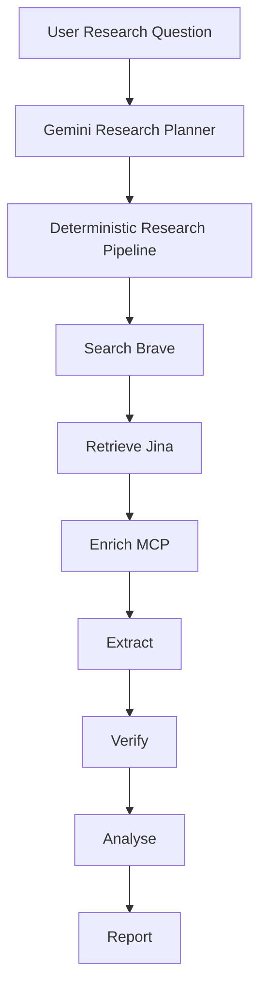

# ResearchFlow AI

An AI-powered business and market research platform that turns complex research questions into structured, evidence-backed reports.

The intended workflow is:

```text
Question
→ Planning
→ Search
→ Retrieve
→ Enrich (MCP company profiles)
→ Extract
→ Verify
→ Analyse
→ Report
```

This is a public portfolio project, built in phases. It is not a fully autonomous research agent.

**Current checkpoint: Phase 4.** Gemini plans the research, extracts quote-backed evidence, analyses the findings, and writes a citation-backed report. Brave Search searches the web and Jina retrieves pages. A local MCP server enriches selected company domains with structured fixture profiles. A deterministic evaluation layer scores research quality and reliability offline. Report citations are validated against project sources.

## Why I built it

The project is designed to demonstrate practical AI engineering and software engineering, not just calling an LLM.

The architecture emphasises:

- structured LLM outputs with Zod validation
- a deterministic research pipeline instead of an uncontrolled agent loop
- tool interfaces for search and page retrieval
- MCP as a real client/server capability boundary
- dependency injection so production uses Gemini and tests use mocks
- a domain model for sources, findings, and reports
- validation at system boundaries
- typed retries and error handling for external model calls
- deterministic, fixture-based evaluations for research quality and reliability
- RAG as a planned extension rather than an unfinished claim

## Current status

- [x] Project foundation
- [x] Authentication foundation
- [x] Research domain model
- [x] Deterministic research pipeline
- [x] Gemini structured research planning
- [x] Real web search — Phase 2B
- [x] Real page retrieval — Phase 2B
- [x] Evidence extraction — Phase 2C
- [x] AI analysis — Phase 2D
- [x] Citation-backed reports — Phase 2D
- [x] MCP company enrichment — Phase 3
- [x] Evaluations + reliability — Phase 4
- [ ] RAG / embeddings — later

You can sign in with Google (when OAuth is configured), submit a research question, inspect Gemini-generated tasks, review Brave Search sources and Jina page content, inspect MCP company-profile Sources, inspect quote-verified findings, and read a citation-backed report whose URLs come from the database.

## Architecture



```text
ResearchFlow Orchestrator
        |
        +-- Internal Tool: Brave Search
        |
        +-- Internal Tool: Jina Retrieval
        |
        +-- MCP Client
               |
               | MCP protocol / stdio
               |
               +-- Company Research MCP Server
                       |
                       +-- lookup_company_profile
                               |
                               +-- structured fixture result
                                       |
                                       +-- Zod validation
                                               |
                                               +-- Source persistence
                                                       |
                                                       +-- Extract / Verify / Analyse / Report
```

**Planning**, **Extract**, **Analyse**, and **Report** use Gemini. **Search** uses Brave Search. **Retrieve** uses Jina Reader. **Enrich** uses an MCP client that explicitly calls `lookup_company_profile` on a local company-research MCP server. The LLM does **not** dynamically choose MCP tools. Report citations are checked against the project's stored sources; URLs are never taken from the model.

```text
app/            UI and thin HTTP routes
lib/research/   orchestration, domain rules, and persistence adapters
lib/ai/         LLMProvider, Gemini, prompts, and test mocks
lib/tools/      internal tools + MCP client/server
lib/eval/       deterministic quality + reliability evaluations
lib/auth/       Auth.js
lib/db/         Prisma
lib/rag/        placeholder
```

The Prisma schema already models `ResearchProject`, `ResearchTask`, `Source`, `Finding`, `Report`, and `Message`.

## AI architecture

- Gemini is behind the `LLMProvider` interface. Research stages do not import `@ai-sdk/google`.
- Structured planning, extraction, analysis, and reports use `generateObject` plus Zod schemas. Findings are quote-checked against the retrieved source. Report citations are validated against the project's stored source IDs. The application attaches source IDs and trusted URLs; the model never creates sources.
- Application code enforces limits after the model returns. Empty goals, titles, and queries are rejected. Extra tasks are clamped and `sortOrder` is normalised.
- The pipeline is deterministic. It does not run a free-roaming agent loop.
- Search and retrieval are represented as internal tools. Production uses Brave Search and Jina; tests inject mock tools.
- MCP enrichment is a separate client/server boundary. The orchestrator selects domains from persisted HTTP(S) Sources and calls `MCPClient.callTool("company-research", "lookup_company_profile", { domain })`. Gemini never selects MCP tools.
- The company-research MCP server is **fixture-backed** for this portfolio/demo milestone. It is not a live external company-data API and must not be described as one.
- Production injects `GeminiProvider`, the production tool registry, and a stdio MCP client. Tests inject `MockLLMProvider`, mock tools, and an in-process MCP client, so `npm test` never requires live API keys.
- Transient Gemini, Brave Search, and Jina failures retry within bounded limits, then fail that call. MCP enrichment is best-effort: one domain failure does not fail the project.
- Phase 4 evaluations sit **beside** the pipeline. They score fixture-driven quality and reliability outcomes without calling live APIs.

## MCP

- **Server:** local `company-research` MCP server over stdio (`@modelcontextprotocol/sdk`)
- **Tool:** `lookup_company_profile` with `{ domain: string }`
- **Provider:** deterministic local fixtures (`stripe.com`, `adyen.com`, `paypal.com`)
- **Client:** application wrapper around the official MCP client; validates responses with Zod
- **Persistence:** successful lookups become Sources with `url = mcp://company-profile/{domain}` and `toolName = mcp:lookup_company_profile`
- **Safety:** `mcp://` URLs are never sent through Jina

## Evaluations + reliability (Phase 4)

Ordinary unit tests prove individual functions. The eval layer measures research-system behaviour as structured scorecards:

- planning constraints (task count, non-empty fields, sort order)
- quote support rate (supported / attempted — not forced to 100%)
- hallucinated quote rejection
- citation hygiene (invented IDs/URLs rejected)
- conflict detection from opposing fixture findings
- MCP / pipeline failure isolation
- retry budgets and non-retryable auth failures

Evaluations are **deterministic and fixture-based**. They use `MockLLMProvider`, mock tools, and in-memory stores. They require **no API keys** and do not call Gemini, Brave, Jina, or live company APIs. Fixture payment-company text is demo/test data only — not live research.

```bash
npm run test:eval
```

The suite also runs as part of `npm test`.

## Tech stack

From the current repository:

- Next.js 16
- React 19
- TypeScript
- Tailwind CSS 4
- PostgreSQL
- Prisma 6
- Gemini (`gemini-2.5-flash` by default)
- Brave Search
- Jina Reader
- Model Context Protocol (`@modelcontextprotocol/sdk`)
- Vercel AI SDK
- Auth.js v5
- Zod 4
- Vitest
- ESLint
- Docker Compose for local Postgres

## Testing

Vitest covers unit, pipeline, store, MCP, eval, and API tests. Default `npm test` uses the mocked LLM provider and excludes live Gemini calls.

Default `npm test` uses mocked LLM, search, and Jina providers, plus an in-process MCP protocol client against local fixtures. No live company-data API is required.

Offline evaluations:

```bash
npm run test:eval
```

Also validated locally:

- `npx tsc --noEmit`
- `npx eslint .`
- `npm run build`

Optional live tests, only when `LIVE_API_TESTS=1`:

```bash
LIVE_API_TESTS=1 npx vitest run --config vitest.live.config.mts
```

## Roadmap

- **Later** — RAG and embeddings
- Optional later MCP work — replace fixture company profiles with a real provider behind the same tool contract

## Engineering principles

- Deterministic orchestration over uncontrolled agent loops
- Structured outputs over free-form parsing
- Validation at system boundaries
- Dependency injection for testability
- Graceful handling of missing keys, timeouts, rate limits, and invalid model output
- Evidence-backed AI outputs as the product direction

## Setup

1. Copy `.env.example` to `.env.local` and set `AUTH_SECRET` (`openssl rand -base64 32`).
2. Start Postgres: `docker compose up -d`
3. Generate the Prisma client and apply migrations: `npx prisma generate && npx prisma migrate deploy`
4. Run the app: `npm run dev`

Google sign-in needs `AUTH_GOOGLE_ID` and `AUTH_GOOGLE_SECRET`. The app boots without them; sign-in stays disabled until those values are set.

Gemini planning needs `GEMINI_API_KEY`. `GEMINI_MODEL` defaults to `gemini-2.5-flash`. Brave Search needs `BRAVE_API_KEY`. Jina retrieval works without `JINA_API_KEY`, but a key raises rate limits. The app boots without these keys; live stages fail with a clear error instead of inventing results.

MCP company enrichment uses local fixtures over stdio. No company-data API key is required for Phase 3.

## Scripts

- `npm run dev` — development server
- `npm run typecheck` — TypeScript
- `npm run lint` — ESLint
- `npm test` — Vitest (includes eval suite)
- `npm run test:eval` — Phase 4 quality + reliability evaluations only
- `LIVE_API_TESTS=1 npx vitest run --config vitest.live.config.mts` — optional live Gemini planning test
- `npm run build` — production build
