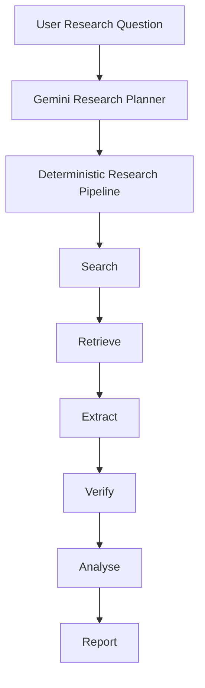

# ResearchFlow AI

An AI-powered business and market research platform that turns complex research questions into structured, evidence-backed reports.

The intended workflow is:

```text
Question
→ Planning
→ Search
→ Retrieve
→ Extract
→ Verify
→ Analyse
→ Report
```

This is a public portfolio project, built in phases. It is not a fully autonomous research agent.

**Current checkpoint: Phase 2A.** Gemini produces a structured research plan. Search, retrieve, extract, verify, analyse, and report are still deterministic mocks.

## Why I built it

The project is designed to demonstrate practical AI engineering and software engineering, not just calling an LLM.

The architecture emphasises:

- structured LLM outputs with Zod validation
- a deterministic research pipeline instead of an uncontrolled agent loop
- tool interfaces for search and page retrieval
- dependency injection so production uses Gemini and tests use mocks
- a domain model for sources, findings, and reports
- validation at system boundaries
- typed retries and error handling for external model calls
- evaluation, MCP, and RAG as planned extensions rather than unfinished claims

## Current status

- [x] Project foundation
- [x] Authentication foundation
- [x] Research domain model
- [x] Deterministic research pipeline
- [x] Gemini structured research planning
- [ ] Real web search — Phase 2B
- [ ] Real page retrieval — Phase 2B
- [ ] Evidence extraction — Phase 2C
- [ ] AI analysis — Phase 2D
- [ ] Citation-backed reports — Phase 2D
- [ ] MCP — Phase 3
- [ ] RAG / embeddings — later

You can sign in with Google (when OAuth is configured), submit a research question, inspect Gemini-generated tasks, and walk through the remaining mocked stages.

## Architecture



Today, only **Planning** is a live Gemini call. **Search**, **Retrieve**, **Extract**, **Verify**, **Analyse**, and **Report** remain mocked so the workflow and persistence can be exercised without web search or page fetching.

```text
app/            UI and thin HTTP routes
lib/research/   orchestration, domain rules, and persistence adapters
lib/ai/         LLMProvider, Gemini, prompts, and test mocks
lib/tools/      internal tool registry; MCP types only
lib/auth/       Auth.js
lib/db/         Prisma
lib/rag/        placeholder
lib/eval/       placeholder
```

The Prisma schema already models `ResearchProject`, `ResearchTask`, `Source`, `Finding`, `Report`, and `Message`.

## AI architecture

- Gemini is behind the `LLMProvider` interface. Research stages do not import `@ai-sdk/google`.
- Structured planning uses `generateObject` plus a Zod schema: goal, dimensions, and up to six tasks with title, query, and sort order.
- Application code enforces limits after the model returns. Empty goals, titles, and queries are rejected. Extra tasks are clamped and `sortOrder` is normalised.
- The pipeline is deterministic. It does not run a free-roaming agent loop.
- Search and retrieval are represented as tools. Production still uses mock implementations.
- Production injects `GeminiProvider`. Tests inject `MockLLMProvider`, so `npm test` never requires `GEMINI_API_KEY`.
- Transient Gemini failures retry once, then fail the planning stage. There is no silent fallback to fake plans.

## Tech stack

From the current repository:

- Next.js 16
- React 19
- TypeScript
- Tailwind CSS 4
- PostgreSQL
- Prisma 6
- Gemini (`gemini-2.5-flash` by default)
- Vercel AI SDK
- Auth.js v5
- Zod 4
- Vitest
- ESLint
- Docker Compose for local Postgres

## Testing

Vitest covers unit, pipeline, store, and API tests. Default `npm test` uses the mocked LLM provider and excludes live Gemini calls.

Current default suite: **11 files, 54 tests**.

Also validated locally:

- `npx tsc --noEmit`
- `npx eslint .`
- `npm run build`

Optional live planning test, only when `LIVE_API_TESTS=1`:

```bash
LIVE_API_TESTS=1 npx vitest run --config vitest.live.config.mts
```

## Roadmap

- **Phase 2B** — Tavily search and Jina page retrieval
- **Phase 2C** — Gemini evidence extraction
- **Phase 2D** — analysis and citation-backed reports
- **Phase 3** — MCP servers
- **Later** — RAG, embeddings, and advanced evaluations

## Engineering principles

- Deterministic orchestration over uncontrolled agent loops
- Structured outputs over free-form parsing
- Validation at system boundaries
- Dependency injection for testability
- Graceful handling of missing keys, timeouts, rate limits, and invalid model output
- Evidence-backed AI outputs as the product direction, even while later stages are still mocked

## Setup

1. Copy `.env.example` to `.env.local` and set `AUTH_SECRET` (`openssl rand -base64 32`).
2. Start Postgres: `docker compose up -d`
3. Generate the Prisma client and apply migrations: `npx prisma generate && npx prisma migrate deploy`
4. Run the app: `npm run dev`

Google sign-in needs `AUTH_GOOGLE_ID` and `AUTH_GOOGLE_SECRET`. The app boots without them; sign-in stays disabled until those values are set.

Gemini planning needs `GEMINI_API_KEY`. `GEMINI_MODEL` defaults to `gemini-2.5-flash`. The app boots without an API key; the planning stage fails with a clear error instead of inventing a fake plan.

## Scripts

- `npm run dev` — development server
- `npm run typecheck` — TypeScript
- `npm run lint` — ESLint
- `npm test` — Vitest
- `LIVE_API_TESTS=1 npx vitest run --config vitest.live.config.mts` — optional live Gemini planning test
- `npm run build` — production build
