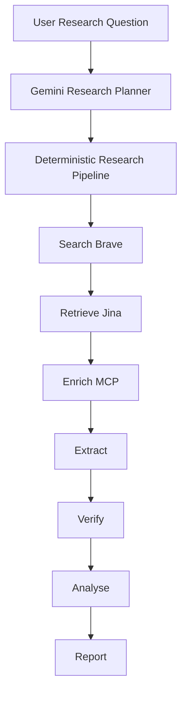

# ResearchFlow AI

Evidence-backed business and market research, built as a **deterministic pipeline** rather than an uncontrolled agent loop.

```text
Question
→ Planning
→ Search
→ Retrieve
→ Enrich (MCP company profiles)
→ Extract
→ Verify
→ Analyse
→ Report
```

This is a public portfolio project. It is not a fully autonomous research agent.

**What it includes today:** Gemini structured planning, extraction, analysis, and reporting; Brave Search; Jina page retrieval; MCP company-profile enrichment over real stdio; quote verification; citation validation against persisted Sources; a Research Trace for provenance; a fixture-based evaluation/reliability suite; and bounded Gemini retries with short backoff on HTTP 429.

## Why I built it

The architecture emphasises practical AI engineering:

- structured LLM outputs with Zod validation
- deterministic orchestration instead of a free-roaming agent loop
- tool interfaces for search and page retrieval
- MCP as a real client/server capability boundary
- dependency injection (production Gemini / mocks in tests)
- evidence grounding: quote checks and citation hygiene
- Research Trace over persisted project data
- typed retries and error handling for external model calls
- deterministic evaluations for quality and reliability
- RAG as a planned extension, not an unfinished claim

## Demo

Example question:

> What are the top competitors of Stripe? Compare pricing, target market, features, strengths and weaknesses.

That path exercises:

**Question → Plan → Search → Retrieve → MCP Enrichment → Extract → Verify → Analyse → Report**

When Brave returns fixture domains such as `stripe.com`, `adyen.com`, or `paypal.com`, MCP enrichment can attach structured company-profile Sources (`mcp://…`) alongside normal HTTP(S) Sources.

## Architecture


```mermaid
flowchart TD
    A[User Research Question] --> B[Gemini Research Planner]
    B --> C[Deterministic Research Pipeline]
    C --> D[Search Brave]
    D --> E[Retrieve Jina]
    E --> F[Enrich MCP]
    F --> G[Extract]
    G --> H[Verify]
    H --> I[Analyse]
    I --> J[Report]
```

```text
ResearchFlow Orchestrator
        |
        +-- Internal Tool: Brave Search
        |
        +-- Internal Tool: Jina Retrieval
        |
        +-- MCP Client
               |
               | MCP protocol / stdio
               |
               +-- Company Research MCP Server
                       |
                       +-- lookup_company_profile
                               |
                               +-- structured fixture result
                                       |
                                       +-- Zod validation
                                               |
                                               +-- Source persistence
                                                       |
                                                       +-- Extract / Verify / Analyse / Report
```

**Planning**, **Extract**, **Analyse**, and **Report** use Gemini. **Search** uses Brave Search. **Retrieve** uses Jina Reader. **Enrich** uses an MCP client that explicitly calls `lookup_company_profile` on a local company-research MCP server. The LLM does **not** dynamically choose MCP tools. Report citations are checked against the project's stored sources; URLs are never taken from the model.

```text
app/            UI and thin HTTP routes
lib/research/   orchestration, domain rules, and persistence adapters
lib/ai/         LLMProvider, Gemini, prompts, and test mocks
lib/tools/      internal tools + MCP client/server
lib/eval/       deterministic quality + reliability evaluations
lib/auth/       Auth.js
lib/db/         Prisma
lib/rag/        placeholder
```

## AI architecture

- Gemini is behind the `LLMProvider` interface. Research stages do not import `@ai-sdk/google`.
- Structured planning, extraction, analysis, and reports use `generateObject` plus Zod schemas. Findings are quote-checked against the retrieved source. Report citations are validated against stored source IDs.
- The pipeline is deterministic. It does not run a free-roaming agent loop.
- Search and retrieval are internal tools. Production uses Brave and Jina; tests inject mocks.
- MCP enrichment is a separate client/server boundary. Gemini never selects MCP tools.
- The company-research MCP server is **fixture-backed** for this portfolio milestone — not a live external company-data API.
- Transient Gemini failures retry once within a bounded budget; HTTP 429 waits for Retry-After (or a short capped backoff) before that single retry. Brave/Jina use their own bounded retries. MCP enrichment is best-effort.
- Phase 4 evaluations sit **beside** the pipeline and score fixture-driven quality/reliability without live APIs.

## MCP

- **Server:** local `company-research` MCP server over stdio (`@modelcontextprotocol/sdk`)
- **Tool:** `lookup_company_profile` with `{ domain: string }`
- **Provider:** deterministic local fixtures (`stripe.com`, `adyen.com`, `paypal.com`)
- **Client:** application wrapper; Zod-validated responses
- **Persistence:** successful lookups become Sources with `url = mcp://company-profile/{domain}` and `toolName = mcp:lookup_company_profile`
- **Safety:** `mcp://` URLs are never sent through Jina

## Evaluations + reliability

Ordinary unit tests prove functions. The eval layer measures research-system behaviour as structured scorecards: planning constraints, quote support rate, hallucinated-quote rejection, citation hygiene, conflict detection, MCP/pipeline failure isolation, and retry budgets.

```bash
npm run test:eval
```

Also runs as part of `npm test`. No API keys required.

## Research Trace

Transparent provenance from question through report, **derived from persisted research data** (tasks, sources, findings, report). Exposed in the UI and via `GET /api/research/[id]` as a structured `trace` object.

It does **not** invent events that were never stored (for example rejected-quote counts or failed MCP lookup counts).

## Verification status

| Layer | Status |
| --- | --- |
| Unit / integration tests (`npm test`) | **PASS** |
| Evaluation suite (`npm run test:eval`) | **PASS** |
| TypeScript (`npm run typecheck`) | **PASS** |
| ESLint (`npm run lint`) | **PASS** |
| Production build (`npm run build`) | **PASS** |
| Full live Prisma + Gemini + Brave + Jina + MCP E2E | **PENDING** |

**External live verification is not claimed as passed.** Two live full-pipeline runs reached real Brave/MCP/Gemini stages and then stopped on Gemini **HTTP 429** quota/rate-limit responses. That is an external API limit, not treated here as a successful E2E result.

Optional live suite (requires keys; may hit quota):

```bash
LIVE_API_TESTS=1 npx vitest run --config vitest.live.config.mts
```

Includes focused live tests plus `tests/live/pipeline-e2e.test.ts` (full production pipeline against PostgreSQL with real Gemini, Brave, Jina, and MCP stdio). Do not interpret a skipped or 429-failed run as a green live E2E.

## Limitations

- MCP company profiles are **fixture-backed demo data**, not live company-data APIs.
- Google sign-in needs `AUTH_GOOGLE_ID` / `AUTH_GOOGLE_SECRET` for local auth testing.
- Full live E2E remains **pending** because of external Gemini quota/rate limiting (HTTP 429).
- Research Trace reconstructs provenance from persisted application data; it is **not** a complete event log.

## Tech stack

Next.js 16, React 19, TypeScript, Tailwind CSS 4, PostgreSQL, Prisma 6, Gemini (`gemini-2.5-flash` by default), Brave Search, Jina Reader, Model Context Protocol (`@modelcontextprotocol/sdk`), Vercel AI SDK, Auth.js v5, Zod 4, Vitest, ESLint, Docker Compose.

## Testing

Default `npm test` uses mocked LLM, search, and Jina providers, plus an in-process MCP client against local fixtures. No live API keys required.

```bash
npm test
npm run test:eval
npm run typecheck
npm run lint
npm run build
```

## Roadmap

- **Later** — RAG and embeddings
- Optional later MCP work — replace fixture profiles with a real provider behind the same tool contract

## Setup

1. Copy `.env.example` to `.env.local` and set `AUTH_SECRET` (`openssl rand -base64 32`).
2. Start Postgres: `docker compose up -d`
3. Generate the Prisma client and apply migrations: `npx prisma generate && npx prisma migrate deploy`
4. Run the app: `npm run dev`

Google sign-in needs `AUTH_GOOGLE_ID` and `AUTH_GOOGLE_SECRET`. Gemini needs `GEMINI_API_KEY`. Brave Search needs `BRAVE_API_KEY`. Jina works without `JINA_API_KEY` (a key raises rate limits). MCP enrichment uses local fixtures over stdio — no company-data API key.

## Scripts

- `npm run dev` — development server
- `npm run typecheck` — TypeScript
- `npm run lint` — ESLint
- `npm test` — Vitest (includes eval suite)
- `npm run test:eval` — quality + reliability evaluations only
- `LIVE_API_TESTS=1 npx vitest run --config vitest.live.config.mts` — optional live external API tests (full pipeline E2E included; may hit Gemini quota)
- `npm run build` — production build

## Screenshots

Capture manually after a successful local run and place under `public/demo/` (for example Trace, evidence provenance, and report). Do not commit fabricated images.
