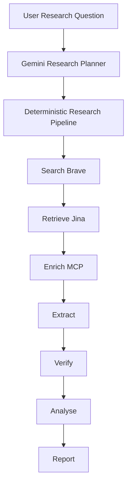

# ResearchFlow AI

Evidence-backed property research, built as a **deterministic pipeline** rather than an uncontrolled agent loop.

**Product.** ResearchFlow helps estate agents, property analysts, developers, and research teams turn a property question into a sourced brief. They can compare developments, research developers, and review areas. The brief keeps public evidence, gaps, and conflicting sources visible, with a Research Trace back to each finding.

**Engineering.** Under that workflow, the same engine demonstrates structured Gemini outputs, deterministic orchestration, dependency injection, Brave Search, Jina retrieval, MCP company-profile enrichment, quote verification, citation validation, offline evaluations, bounded retry/backoff, a provenance Trace, and Prisma persistence. The engine can support other research domains. It is not a chatbot, a property database, a valuation tool, or an investment advisor.

```text
Question
→ Planning
→ Search
→ Retrieve
→ Enrich (MCP company profiles)
→ Extract
→ Verify
→ Analyse
→ Report
```

This is a public portfolio project. The full external live run is still pending.

**What it includes today:** real-estate research templates (Competitor, Property, Area, Developer, Market); Gemini structured planning, extraction, analysis, and reporting; Brave Search; Jina page retrieval; MCP company-profile enrichment over real stdio; quote verification; citation validation against persisted Sources; a Research Trace for provenance; a fixture-based evaluation/reliability suite; and bounded Gemini retries with short backoff on HTTP 429.

## Why I built it

The architecture emphasises practical AI engineering:

- structured LLM outputs with Zod validation
- deterministic orchestration instead of a free-roaming agent loop
- tool interfaces for search and page retrieval
- MCP as a real client/server capability boundary
- dependency injection (production Gemini / mocks in tests)
- evidence grounding: quote checks and citation hygiene
- Research Trace over persisted project data
- typed retries and error handling for external model calls
- deterministic evaluations for quality and reliability
- RAG as a planned extension, not an unfinished claim

The same codebase is ordinary software engineering: Next.js, TypeScript, Prisma/PostgreSQL, Auth.js, injected tools, tests, and explicit failure handling.

The first product workflow is a sourced real-estate brief: competitor and development research, missing prices and specifications recorded as gaps, and an explainable Research Trace.

## Demo

Intended demonstration question:

> What are the top residential developments competing with Dubai Marina? Compare developer, price positioning, amenities, target market and differentiators. Record missing prices or specifications as gaps.

That question is the portfolio demo workflow. It has **not** been claimed as a successful live run through Gemini.

The path a run is built to show:

**Question → Plan → Search → Retrieve → MCP Enrichment → Extract → Verify → Analyse → Report**

Web evidence comes from Brave and Jina as normal HTTP(S) pages. MCP enrichment attaches a local demo company profile only when a retrieved hostname matches a fixture domain. Those profiles are not live company data.

## Real-estate demo

Competitor comparison is the primary demo. Property, developer, area, and market workflows use the same pipeline. MCP developer profiles are local fixture data. Reports are grounded in retrieved sources. The product is research support, not valuation or investment advice.

## Architecture


```mermaid
flowchart TD
    A[User Research Question] --> B[Gemini Research Planner]
    B --> C[Deterministic Research Pipeline]
    C --> D[Search Brave]
    D --> E[Retrieve Jina]
    E --> F[Enrich MCP]
    F --> G[Extract]
    G --> H[Verify]
    H --> I[Analyse]
    I --> J[Report]
```

```text
ResearchFlow Orchestrator
        |
        +-- Internal Tool: Brave Search
        |
        +-- Internal Tool: Jina Retrieval
        |
        +-- MCP Client
               |
               | MCP protocol / stdio
               |
               +-- Company Research MCP Server
                       |
                       +-- lookup_company_profile
                               |
                               +-- structured fixture result
                                       |
                                       +-- Zod validation
                                               |
                                               +-- Source persistence
                                                       |
                                                       +-- Extract / Verify / Analyse / Report
```

**Planning**, **Extract**, **Analyse**, and **Report** use Gemini. **Search** uses Brave Search. **Retrieve** uses Jina Reader. **Enrich** uses an MCP client that explicitly calls `lookup_company_profile` on a local company-research MCP server. The LLM does **not** dynamically choose MCP tools. Report citations are checked against the project's stored sources; URLs are never taken from the model.

```text
app/            UI and thin HTTP routes
lib/research/   orchestration, domain rules, and persistence adapters
lib/ai/         LLMProvider, Gemini, prompts, and test mocks
lib/tools/      internal tools + MCP client/server
lib/eval/       deterministic quality + reliability evaluations
lib/auth/       Auth.js
lib/db/         Prisma
lib/rag/        placeholder
```

## AI architecture

- Gemini is behind the `LLMProvider` interface. Research stages do not import `@ai-sdk/google`.
- Structured planning, extraction, analysis, and reports use `generateObject` plus Zod schemas. Findings are quote-checked against the retrieved source. Report citations are validated against stored source IDs.
- The pipeline is deterministic. It does not run a free-roaming agent loop.
- Search and retrieval are internal tools. Production uses Brave and Jina; tests inject mocks.
- MCP enrichment is a separate client/server boundary. Gemini never selects MCP tools.
- The company-research MCP server is **fixture-backed** for this portfolio milestone — not a live external company-data API.
- Transient Gemini failures retry once within a bounded budget; HTTP 429 waits for Retry-After (or a short capped backoff) before that single retry. Brave/Jina use their own bounded retries. MCP enrichment is best-effort.
- Phase 4 evaluations sit **beside** the pipeline and score fixture-driven quality/reliability without live APIs.

## MCP

**Web sources**

- Brave Search and Jina Reader
- HTTP/HTTPS pages
- Externally retrieved evidence, stored as ordinary sources

**MCP demo profiles**

- Local deterministic fixtures, read by `lookup_company_profile({ domain })`
- Persisted as `mcp://company-profile/{domain}` with `toolName = mcp:lookup_company_profile`
- Not live company APIs
- Not a property database
- Not live market data

Fixture domains in `lib/tools/mcp/fixtures/companies.json`:

- `stripe.com`
- `adyen.com`
- `paypal.com`
- `emaar.com`
- `damacproperties.com`
- `select-group.ae`

`stripe.com`, `adyen.com`, and `paypal.com` are the original payment-company fixtures. `emaar.com`, `damacproperties.com`, and `select-group.ae` are local real-estate demo profiles for the portfolio workflow. A profile is attached only when retrieval already returned that hostname. Unknown domains return not found and do not fail the project. `mcp://` URLs are never sent through Jina.

## Evaluations + reliability

Ordinary unit tests prove functions. The eval layer measures research-system behaviour as structured scorecards: planning constraints, quote support rate, hallucinated-quote rejection, citation hygiene, conflict detection, MCP/pipeline failure isolation, and retry budgets.

```bash
npm run test:eval
```

Also runs as part of `npm test`. No API keys required.

## Research Trace

Transparent provenance from question through report, **derived from persisted research data** (tasks, sources, findings, report). Exposed in the UI and via `GET /api/research/[id]` as a structured `trace` object.

It does **not** invent events that were never stored (for example rejected-quote counts or failed MCP lookup counts).

## Verification status

| Layer | Status |
| --- | --- |
| Unit / integration tests (`npm test`) | **PASS** |
| Evaluation suite (`npm run test:eval`) | **PASS** |
| TypeScript (`npm run typecheck`) | **PASS** |
| ESLint (`npm run lint`) | **PASS** |
| Production build (`npm run build`) | **PASS** |
| Full live Prisma + Gemini + Brave + Jina + MCP E2E | **PENDING** — blocked by Gemini HTTP 429 |

**External live verification is not claimed as passed.** Two live full-pipeline runs reached real Brave/MCP/Gemini stages and then stopped on Gemini **HTTP 429** quota/rate-limit responses. That is an external API limit, not treated here as a successful E2E result. The real-estate demo question has not been claimed as a completed live run.

Optional live suite (requires keys; may hit quota):

```bash
LIVE_API_TESTS=1 npx vitest run --config vitest.live.config.mts
```

Includes focused live tests plus `tests/live/pipeline-e2e.test.ts` (full production pipeline against PostgreSQL with real Gemini, Brave, Jina, and MCP stdio). Do not interpret a skipped or 429-failed run as a green live E2E.

## Limitations

- MCP company profiles are local fixture/demo data. They are not live company-data APIs, a property database, or live market data.
- Property prices and specifications appear only when a retrieved source supports them. Missing prices and specifications are recorded as gaps.
- Search and retrieval stay inside the current caps: 6 research tasks, 5 results per task, 12 retrieved pages, and 3 company-profile lookups.
- The product is research support. It does not provide valuations, investment advice, or transaction advice.
- Full live Prisma + Gemini + Brave + Jina + MCP E2E remains pending because previous live attempts returned Gemini HTTP 429.
- Google sign-in needs `AUTH_GOOGLE_ID` / `AUTH_GOOGLE_SECRET` for local auth testing.
- Research Trace reconstructs provenance from persisted application data; it is not a complete event log.

## Tech stack

Next.js 16, React 19, TypeScript, Tailwind CSS 4, PostgreSQL, Prisma 6, Gemini (`gemini-2.5-flash` by default), Brave Search, Jina Reader, Model Context Protocol (`@modelcontextprotocol/sdk`), Vercel AI SDK, Auth.js v5, Zod 4, Vitest, ESLint, Docker Compose.

## Testing

Default `npm test` uses mocked LLM, search, and Jina providers, plus an in-process MCP client against local fixtures. No live API keys required.

```bash
npm test
npm run test:eval
npm run typecheck
npm run lint
npm run build
```

## Roadmap

- **Later** — RAG and embeddings
- Optional later MCP work — replace fixture profiles with a real provider behind the same tool contract

## Setup

1. Copy `.env.example` to `.env.local` and set `AUTH_SECRET` (`openssl rand -base64 32`).
2. Start Postgres: `docker compose up -d`
3. Generate the Prisma client and apply migrations: `npx prisma generate && npx prisma migrate deploy`
4. Run the app: `npm run dev`

Google sign-in needs `AUTH_GOOGLE_ID` and `AUTH_GOOGLE_SECRET`. Gemini needs `GEMINI_API_KEY`. Brave Search needs `BRAVE_API_KEY`. Jina works without `JINA_API_KEY` (a key raises rate limits). MCP enrichment uses local fixtures over stdio — no company-data API key.

## Scripts

- `npm run dev` — development server
- `npm run typecheck` — TypeScript
- `npm run lint` — ESLint
- `npm test` — Vitest (includes eval suite)
- `npm run test:eval` — quality + reliability evaluations only
- `LIVE_API_TESTS=1 npx vitest run --config vitest.live.config.mts` — optional live external API tests (full pipeline E2E included; may hit Gemini quota)
- `npm run build` — production build

## Screenshots

Demo screenshots can be captured from the local application. This repository does not include product screenshots.
